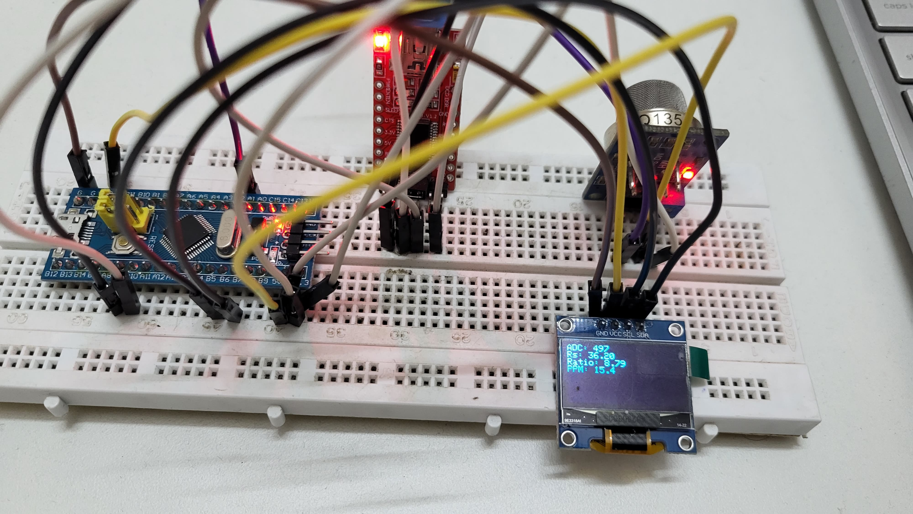
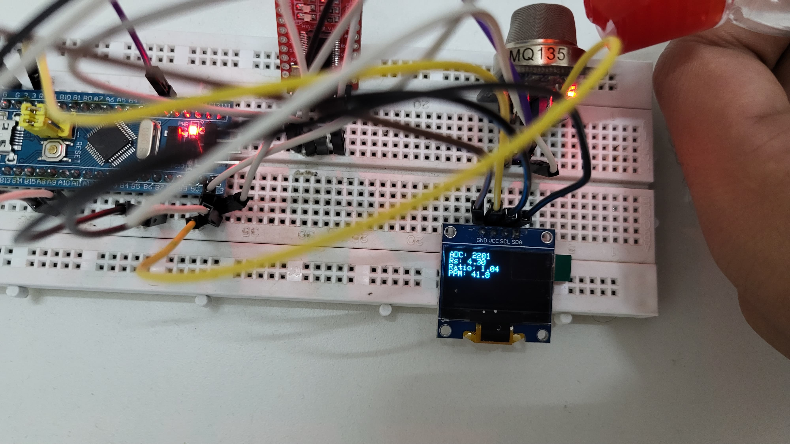

# AirQualityMonitor-STM32

A real-time air quality monitoring system using STM32F103C8T6 (Blue Pill), MQ-135 gas sensor, and a 0.96" OLED display. This project was developed as part of the Experiential Learning Program under ARM to explore embedded system design using ARM Cortex-M3.

---

## Project Overview

This project presents a compact and cost-effective air quality monitoring device that detects gas concentration using the MQ-135 sensor and displays values in PPM (Parts Per Million) on an OLED screen. The STM32F103C8T6 (Blue Pill) microcontroller reads analog sensor data, processes it through ADC, and displays it in real-time using I2C OLED interfacing.

---

## Features

- Real-time monitoring of air pollutants (Alcohol, NH₃, CO₂, Benzene)
- OLED display with I2C interface (SSD1306)
- Sensor calibration using clean-air resistance
- 12-bit ADC resolution on STM32 for improved accuracy
- Portable and low-power embedded system

---

## Components Used

| Component              | Description                                      |
|------------------------|--------------------------------------------------|
| STM32F103C8T6          | 32-bit ARM Cortex-M3 microcontroller             |
| MQ-135 Gas Sensor      | Detects CO₂, NH₃, Benzene, Alcohol, Smoke        |
| 0.96" OLED Display     | SSD1306 I2C-based OLED (128x64)                  |
| FTDI Programmer        | USB-to-Serial for STM32 upload                   |
| Breadboard + Jumper Wires | For prototyping                             |
| Power Source           | 3.3V / 5V via USB or external supply             |

---

## Circuit Connections

| Component   | STM32 Pin | Description           |
|-------------|-----------|-----------------------|
| MQ-135 A0   | PA1       | Analog input (ADC)    |
| OLED SDA    | PB7       | I2C Data              |
| OLED SCL    | PB6       | I2C Clock             |
| OLED VCC    | 3.3V      | Power Supply          |
| OLED GND    | GND       | Ground                |

---
## Oled Display output format
```
ADC: xxxx
Rs:  x.xx kΩ
Ratio: x.xx
PPM: xxx.x
```
---

## Group Photo and Hardware Results

### Group Photo

<p align="center">
  

### Hardware Result – Before Alcohol Detection

<p align="center">
  

- Lower PPM value indicates clean air
- High Rs/Ro ratio
- Low to medium ADC voltage

### Hardware Result – After Alcohol Detection

<p align="center">
  

- Increased PPM value due to alcohol vapors
- Rs/Ro ratio drops significantly
- Higher ADC value confirms strong gas presence

---

## Code Summary

The code uses STM32 HAL and Arduino-style functions to:

1. Read analog value from MQ-135 sensor via ADC (12-bit resolution)
2. Convert ADC to voltage
3. Calculate sensor resistance (Rs)
4. Determine ratio Rs/Ro using a calibrated Ro value
5. Estimate gas PPM using the MQ-135 logarithmic model
6. Display results on the OLED

### Code Snippet

```cpp
int adcValue = analogRead(PA1);
float voltage = (adcValue / 4095.0) * 3.3;
float Rs = ((3.3 - voltage) / voltage) * RL_VALUE;
float ppm = pow(10, (-0.47 * log10(Rs / Ro) + 1.63));
```

---


## Contributors

- Ballambettu Milan Shankar Bhat (4NI23EC019)
- Pranav Maruti Shanbhag (4NI24EC407)
- Anirudha Jayaprakash (4NI23EC014)
- Adithya Y (4NI23EC005)
